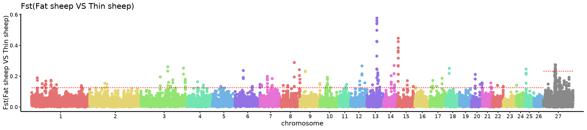
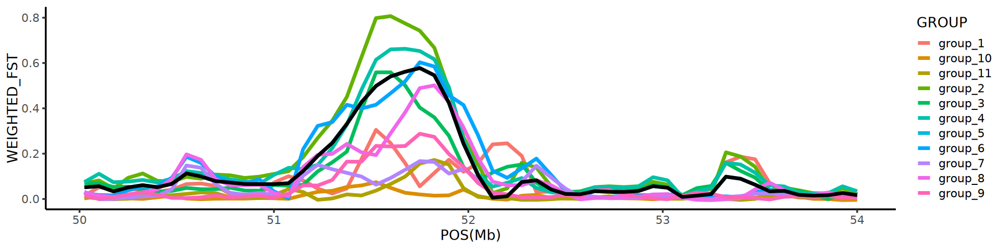
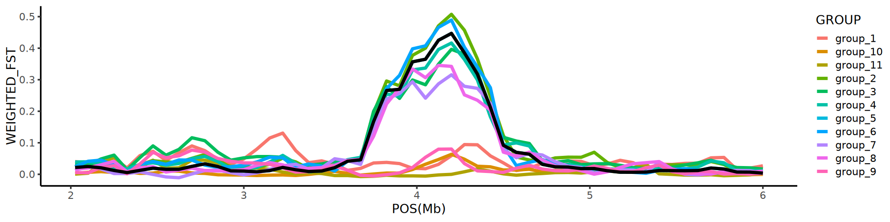
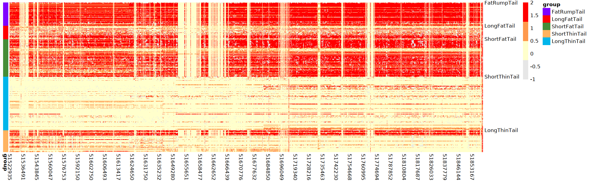
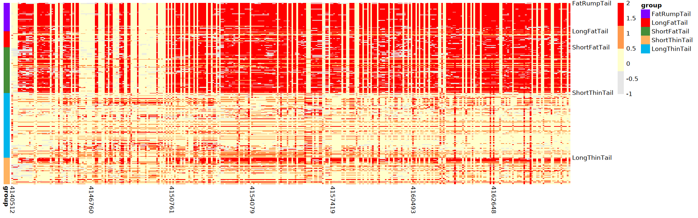
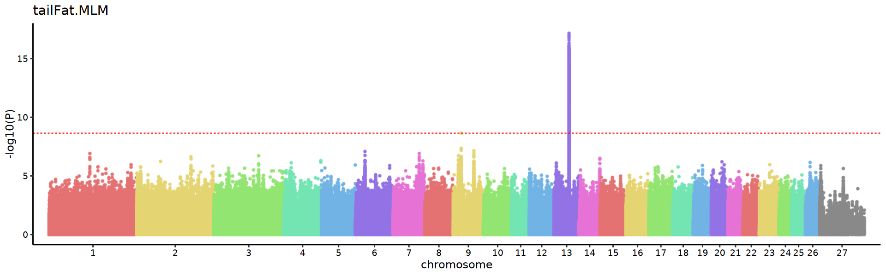
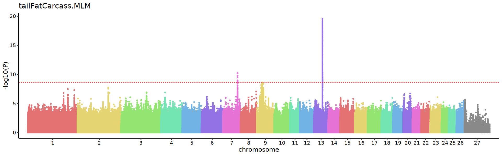
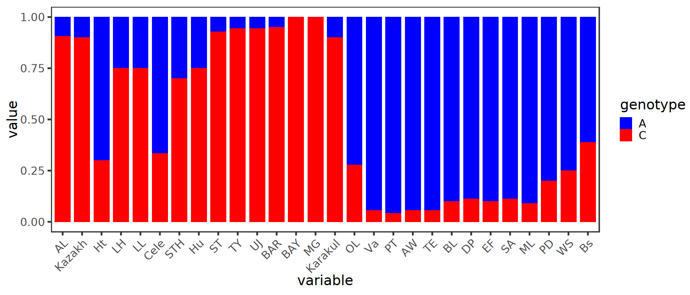
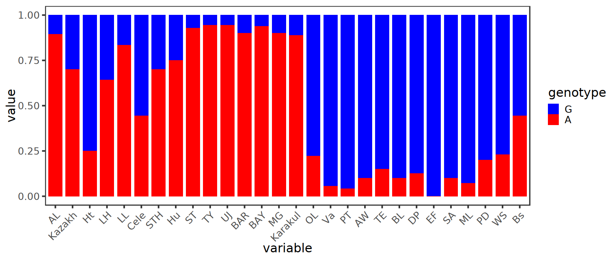

# **Comprehensive multi-tissue epigenome atlas in *Ovis aries*:** **A resource for sheep** **complex traits, domestication and breeding**

## Figure 1-4 code

```shell
Figure_info/Figure1_4/*
```

## Figure 5-7 code
### Code Author: Xiaolong Li

### Figure 5

### Figure 5B


```R
setwd("/mnt/e/20_github_file/Sheep-epigenome-atlas-and-multi-Omics-analysis")
getwd()
```


'/mnt/e/20_github_file/Sheep-epigenome-atlas-and-multi-Omics-analysis'


```R
library(tidyverse)
library(data.table)
```


### source code
source.self.lxl.ggplot.manhattan.2.r: The code is publicly available at https://github.com/Xiaolong0803/Greatly-reduce-the-pdf-file-size-of-manhanttan-diagram


```R
source("../source.self.lxl.ggplot.manhattan.2.r")
```


```R
options(repr.plot.width = 18,repr.plot.height = 4)
p_fei_shou <- selfFstManhattan("Figure_info/Figure5_7/tail_fei_tail_shou.windowed.weir.fst","fei vs shou")
p_fei_shou
```


​    

​    

### Figure 5C


```R
lineData_10_13 <- fread("Figure_info/Figure5_7/lineData_10_13.txt")
lineData_feishou_13 <- fread("Figure_info/Figure5_7/lineData_feishou_13.txt")
```


```R
options(repr.plot.width = 16, repr.plot.height = 4)
ggplot()+
    geom_line(data=lineData_10_13,aes(POS,WEIGHTED_FST,color=GROUP),linewidth=1.5)+
    geom_line(data=lineData_feishou_13,aes(POS,WEIGHTED_FST,color=GROUP),linewidth=1.5,color="black")+
    theme_classic(base_size = 16)+
    labs(x="POS(Mb)") -> p_line_13_48M_54M_plot
p_line_13_48M_54M_plot
```


​    

​    

### Figure 5D


```R
lineData_10_15 <- fread("Figure_info/Figure5_7/lineData_10_15.txt")
lineData_feishou_15 <- fread("Figure_info/Figure5_7/lineData_feishou_15.txt")
```


```R
options(repr.plot.width = 16, repr.plot.height = 4)
ggplot()+
    geom_line(data=lineData_10_15,aes(POS,WEIGHTED_FST,color=GROUP),linewidth=1.5)+
    geom_line(data=lineData_feishou_15,aes(POS,WEIGHTED_FST,color=GROUP),linewidth=1.5,color="black")+
    theme_classic(base_size = 16)+
    labs(x="POS(Mb)") -> p_line_15_2M_6M_plot
p_line_15_2M_6M_plot
```


​    

​    


### Figure 5E


```R
library(pheatmap)
```


```R
self_color <- setNames(c("#e6e6e6", "#ffffcc", "#ff994d", "#ff0000"), c(-1, 0, 1, 2))

lineData_heatmap_chr13_51522935_51863333 <- fread("Figure_info/Figure5_7/lineData_heatmap_chr13_51522935_51863333.txt",data.table=FALSE) %>% {rownames(.) <- .$col;.$col <- NULL;.}
annotation_row <- fread("Figure_info/Figure5_7/lineData_heatmap_chr13_51522935_51863333_annotation_row.txt",data.table=FALSE) %>% {rownames(.) <- .$col;.$col <- NULL;.}

annotation_colors <- list()
annotation_colors$group <- c("#8000FF","#FF0000","#458d38","#FFB360","#00B5EB")
names(annotation_colors$group) <- c("FatRumpTail","LongFatTail","ShortFatTail","ShortThinTail","LongThinTail")

self_labels_col <- fread("Figure_info/Figure5_7/lineData_heatmap_chr13_51522935_51863333_self_labels_col.txt") %>% mutate(case_when(
    is.na(self_labels_col) ~ "",
    TRUE ~ as.character(self_labels_col)
)) %>%{.[,2]} %>% pull()

self_labels_row <- fread("Figure_info/Figure5_7/lineData_heatmap_chr13_51522935_51863333_self_labels_row.txt") %>% mutate(case_when(
    is.na(self_labels_row) ~ "",
    TRUE ~ as.character(self_labels_row)
)) %>%{.[,2]} %>% pull()
```


```R
options(repr.plot.width = 16, repr.plot.height = 5)
lineData_heatmap_chr13_51522935_51863333 %>% t() %>% 
                                            pheatmap(.,cluster_rows = F,cluster_cols = F,
                                            color = self_color,
                                            annotation_row = annotation_row,
                                            annotation_colors = annotation_colors,
                                            labels_col = self_labels_col,
                                            labels_row = self_labels_row)
```


​    

​    


### Figure 5F


```R
lineData_heatmap_chr15_4140512_4167000 <- fread("Figure_info/Figure5_7/lineData_heatmap_chr15_4140512_4167000.txt",data.table=FALSE) %>% {rownames(.) <- .$col;.$col <- NULL;.}
annotation_row <- fread("Figure_info/Figure5_7/lineData_heatmap_chr13_51522935_51863333_annotation_row.txt",data.table=FALSE) %>% {rownames(.) <- .$col;.$col <- NULL;.}

self_labels_col <- fread("Figure_info/Figure5_7/lineData_heatmap_chr15_4140512_4167000_self_labels_col.txt") %>% mutate(case_when(
    is.na(self_labels_col) ~ "",
    TRUE ~ as.character(self_labels_col)
)) %>%{.[,2]} %>% pull()

self_labels_row <- fread("Figure_info/Figure5_7/lineData_heatmap_chr15_4140512_4167000_self_labels_row.txt") %>% mutate(case_when(
    is.na(self_labels_row) ~ "",
    TRUE ~ as.character(self_labels_row)
)) %>%{.[,2]} %>% pull()
```


```R
options(repr.plot.width = 16, repr.plot.height = 5)
lineData_heatmap_chr15_4140512_4167000 %>% t() %>% 
                                            pheatmap(.,cluster_rows = F,cluster_cols = F,
                                            color = self_color,
                                            annotation_row = annotation_row,
                                            annotation_colors = annotation_colors,
                                            labels_col = self_labels_col,
                                            labels_row = self_labels_row)
```


​    

​    


### Figure 6

### Figure 6B

#### source code
The code is publicly available at https://github.com/Xiaolong0803/Greatly-reduce-the-pdf-file-size-of-manhanttan-diagram

#### Tail Fat Weight


```R
library(ggrastr)
```


```R
change_data <- function(p_data){
chr_list <- distinct(p_data,CHR)$CHR
p_data$p_value <- -log10(p_data$P)
p_signal_line <<- -log10(0.05/nrow(p_data))

self_color_all_list <- c(
  "#E57272","#E5D572","#93E572","#72E5B3","#72B3E5","#9372E5","#E672D5","#E57272","#E5D572","#93E572",
  "#72E5B3","#72B3E5","#9372E5","#E672D5","#E57272","#E5D572","#93E572","#72E5B3","#72B3E5","#9372E5",
  "#E672D5","#E57272","#E5D572","#93E572","#72E5B3","#72B3E5","#898989","#E57272","#E5D572","#93E572",
  "#E672D5","#E57272","#E5D572","#93E572","#72E5B3","#72B3E5","#898989","#E57272","#E5D572","#93E572")
self_color <<- self_color_all_list[1:length(chr_list)]
max_value_list <- c()
for(i in chr_list){max_value_list[i]=max(subset(p_data,CHR==i)$POS)}
name_x_axis <- chr_list
names(name_x_axis) <- chr_list
value_x_axis <- c(0,cumsum(as.numeric(max_value_list[-length(max_value_list)])))
names(value_x_axis) <- chr_list
final_data <<- data.frame(CHR=p_data$CHR,POS=(p_data$POS+value_x_axis[as.character(p_data$CHR)]),p_value=p_data$p_value)
final_data$CHR <<- factor(final_data$CHR,levels=chr_list)
x_breaks <- function(demo_data,demo){
  min_pos=min(subset(demo_data,CHR == demo)$POS)
  max_pos=max(subset(demo_data,CHR == demo)$POS)
  mean(c(max_pos,min_pos))}
x_break_value <- c()
for(i in chr_list){x_break_value[i]=x_breaks(final_data,i)}
x_break_value <<- x_break_value
names(x_break_value) <<- chr_list
}
```


```R
gwas_data_tailFat <- fread("Figure_info/Figure5_7/tailFat.MLM.csv.gz",data.table=F ,sep=",") %>%
                select(c("SNP","CHROM","POS","tailFat.MLM")) %>%
                {colnames(.) <- c("SNP","CHR","POS","P");.}
change_data(gwas_data_tailFat)
```


```R
options(ggrastr.default.dpi=100)
options(repr.plot.width = 16, repr.plot.height = 5)
p_tailFat <- ggplot(final_data,aes(x=POS,y=p_value,colour=CHR))+
    rasterise(geom_point(size=1))+
    scale_x_continuous(expand = c(0.02,0.01),breaks=x_break_value,labels=names(x_break_value))+
    geom_hline(yintercept = p_signal_line,linetype="dashed",color="red")+
    scale_color_manual(values = self_color)+
    theme_classic(base_size=14)+
    theme(legend.position='none',
        axis.text.x=element_text(color="black"), 
        axis.text.y=element_text(color="black"))+
    labs(x="chromosome",y="-log10(P)",title="tailFat.MLM")
p_tailFat
```



    


#### The relative of tail fat weight(Carcass weight)


```R
gwas_data_tailFatCarcass <- fread("Figure_info/Figure5_7/tailFatCarcass.MLM.csv.gz",data.table=F ,sep=",") %>%
                select(c("SNP","CHROM","POS","tailFatCarcass.MLM")) %>%
                {colnames(.) <- c("SNP","CHR","POS","P");.}
change_data(gwas_data_tailFatCarcass)
```


```R
options(ggrastr.default.dpi=600)
options(repr.plot.width = 16, repr.plot.height = 5)
p_tailFatCarcass <- ggplot(final_data,aes(x=POS,y=p_value,colour=CHR))+
    rasterise(geom_point(size=1))+
    scale_x_continuous(expand = c(0.02,0.01),breaks=x_break_value,labels=names(x_break_value))+
    geom_hline(yintercept = p_signal_line,linetype="dashed",color="red")+
    scale_color_manual(values = self_color)+
    theme_classic(base_size=14)+
    theme(legend.position='none',
        axis.text.x=element_text(color="black"), 
        axis.text.y=element_text(color="black"))+
    labs(x="chromosome",y="-log10(P)",title="tailFatCarcass.MLM")
p_tailFatCarcass
```


​    

​    


### Figure 7

### Figure 7A


```R
mydata_51760995 <- fread("Figure_info/Figure5_7/mydata_51760995.txt")
mydata_51760995$genotype <- factor(mydata_51760995$genotype,levels=c("A","C"))
mydata_51760995$variable <- factor(mydata_51760995$variable,levels=
                         c('AL','Kazakh','Ht','LH','LL',
                           "Cele","STH","Hu","ST","TY","UJ","BAR","BAY","MG",
                           "Karakul","OL","Va","PT",
                           "AW","TE","BL","DP","EF","SA","ML","PD","WS","Bs"))
```


```R
options(repr.plot.width = 14,repr.plot.height = 6)
pinlv_51760995 <- ggplot(mydata_51760995,aes(variable, value),position="stack") +
  geom_bar(aes(fill = genotype), stat = "identity",color="black",linewidth=0,
           position = "fill", width = 0.8,data=mydata_51760995)+
 scale_fill_manual(values = c("A" = "blue", "C" = "red"))+
  theme_bw(base_size = 20)+
  theme(panel.grid = element_blank(),
       axis.text.x = element_text(angle = 45, hjust = 1))
pinlv_51760995
```



    


### Figure 7B


```R
mydata_51825895 <- fread("Figure_info/Figure5_7/mydata_51825895.txt")
mydata_51825895$genotype <- factor(mydata_51825895$genotype,levels=c("G","A"))
mydata_51825895$variable <- factor(mydata_51825895$variable,levels=
                         c('AL','Kazakh','Ht','LH','LL',
                           "Cele","STH","Hu","ST","TY","UJ","BAR","BAY","MG",
                           "Karakul","OL","Va","PT",
                           "AW","TE","BL","DP","EF","SA","ML","PD","WS","Bs"))
```


```R
options(repr.plot.width = 14,repr.plot.height = 6)
pinlv_51825895 <- ggplot(mydata_51825895,aes(variable, value),position="stack") +
  geom_bar(aes(fill = genotype), stat = "identity",color="black",linewidth=0,
           position = "fill", width = 0.8,data=mydata_51825895)+
 scale_fill_manual(values = c("G" = "blue", "A" = "red"))+
  theme_bw(base_size = 20)+
  theme(panel.grid = element_blank(),
       axis.text.x = element_text(angle = 45, hjust = 1))
pinlv_51825895
```


​    

​    

